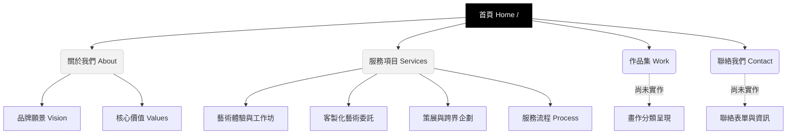

# 忙碌不迷路藝術工作坊 (Find the Way Art) - 網站架構與技術文件

本文件記錄了「忙碌不迷路藝術工作坊」官方網站的頁面架構、專案目錄結構以及核心技術選型。

## 1. 網站頁面架構圖 (Sitemap)

以下是網站的導覽與內容架構：



### 網站內容層級圖 (Tree Structure)

以樹狀圖的結構呈現，能更清楚對應每個分頁的階層關係：

```text
Find the Way Art 網站
├── 首頁 Home
│   ├── 關於我們 About
│   │   ├── 品牌願景 Vision
│   │   └── 核心價值 Values
│   ├── 服務項目 Services
│   │   ├── 藝術體驗與工作坊
│   │   ├── 客製化藝術委託
│   │   ├── 策展與跨界企劃
│   │   └── 服務流程 Process
│   ├── 作品集 Work
│   │   └── 畫作分類呈現
│   └── 聯絡我們 Contact
│       └── 聯絡表單與資訊
```

## 2. 專案目錄結構 (Directory Structure)

本網站基於 **Next.js (App Router)** 開發，主要目錄與檔案配置如下：

```text
Findtheway/
├── package.json          # 專案套件設定檔 (包含 next, framer-motion, react-icons 等)
├── tailwind.config.ts    # Tailwind CSS 設定檔
├── src/
│   └── app/
│       ├── globals.css   # 全域樣式 (設定字體變數、SVG雜訊濾鏡、基礎顏色)
│       ├── layout.tsx    # 全域佈局 (引入 Inter 與 Playfair Display 字體)
│       ├── page.tsx      # 首頁 (Hero Section, 雜訊背景, 膠囊按鈕, 精簡版服務列表)
│       ├── about/
│       │   └── page.tsx  # 關於我們內頁 (品牌理念與核心價值)
│       └── service/
│           └── page.tsx  # 服務項目內頁 (詳細服務條列與四步驟流程)
└── public/               # 靜態資源資料夾 (供放置圖片、logo 等)
```

## 3. 設計語彙與美學 (Design System)

為了還原極簡、高級的畫廊質感，本網站採用了以下設計規範：

*   **顏色 (Color Palette):** 
    *   主背景: 純白 `#ffffff`
    *   次背景 (如首頁與About區塊): 極淺灰 `#f2f2f2`
    *   文字與線條: 純黑 `#000000` 或半透明黑 (`black/40`, `black/60`)
*   **字體 (Typography):**
    *   英文標題/導覽列: 幾何無襯線體 (Inter, Helvetica), 大字距全小寫設計。
    *   中文標題與重點文字: 現代襯線體 (Playfair Display, Noto Serif TC)。
*   **視覺特效 (Effects):**
    *   **SVG 雜訊濾鏡 (Noise Overlay):** 模擬紙張或底片的顆粒質感，降低數位感。
    *   **Framer Motion:** 應用於滾動視差與淡入浮現 (`opacity`, `y`)，使瀏覽體驗如呼吸般平穩。
    *   **圓弧分隔線 (Curved SVG Divider):** 在區塊交界處使用往上的圓弧，象徵「入雲」般的輕柔感。
